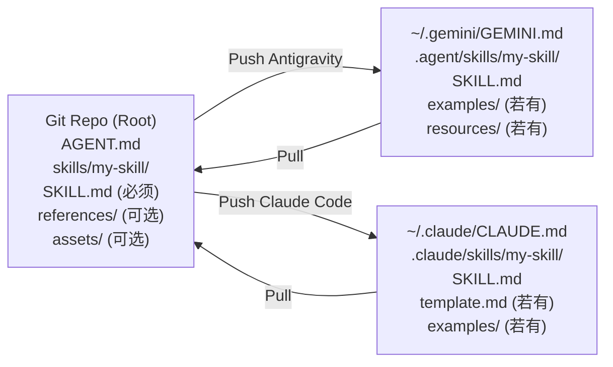

# AgentDNA v3.1 - 多格式同步架构设计文档

> **核心思想**：以 **Open Source Standard** 作为规范化存储格式（唯一真实来源），
> AgentDNA 在 Push/Pull 时充当"格式转换层 (Adapter)"，按用户指定的目标工具将文件转换为对应格式。

---

## 1. 问题背景

AgentDNA v3 目前的同步策略是将仓库中的 `.gemini/GEMINI.md` 和 `.agent/skills/` 直接同步到本地，
这与 Antigravity (Gemini) 的格式完全绑定。当用户切换到 Claude Code 时，路径和文件命名均不兼容，
需要手动迁移。

### 当前架构的局限

| 问题 | 描述 |
| :--- | :--- |
| **格式锁定** | 仓库格式与 Antigravity 格式耦合，换用 Claude Code 需手动适配 |
| **路径不一致** | `GEMINI.md` 与 `CLAUDE.md`、`.agent/skills/` 与 `.claude/skills/` 路径差异大 |
| **来源不唯一** | 没有统一的"标准格式"作为转换基准 |

---

## 2. 设计目标

1. **仓库格式与工具解耦**：仓库中只存储 Open Source Standard 格式，与具体工具无关。
2. **一键切换工具**：用户可在设置中指定当前工具，Push 时自动完成格式转换与路径映射。
3. **可逆性**：Pull 时能将工具格式逆转换回 Open Source Standard（可选，分阶段实现）。

---

## 3. 架构设计：Hub-and-Spoke 模型

```
                    ┌─────────────────────────────┐
                    │       Git Repository         │
                    │   (Open Source Standard)     │
                    │                              │
                    │  AGENT.md                    │
                    │  skills/                     │
                    │  └── my-skill/               │
                    │      ├── SKILL.md (必须)      │
                    │      ├── scripts/  (可选)     │
                    │      ├── references/ (可选)   │
                    │      └── assets/   (可选)     │
                    └──────────────┬───────────────┘
                                   │
                          AgentDNA 转换层
                         (FormatAdapter)
                        ┌────────────────┐
                        │  Push / Pull   │
                        └───────┬────────┘
               ┌────────────────┴─────────────────┐
               ▼                                   ▼
   ┌───────────────────────┐         ┌──────────────────────────┐
   │  Antigravity (Gemini) │         │      Claude Code          │
   │                       │         │                          │
   │ ~/.gemini/GEMINI.md   │         │ ~/.claude/CLAUDE.md      │
   │ .agent/skills/        │         │ .claude/skills/          │
   │   └── my-skill/       │         │   └── my-skill/          │
   │       ├── SKILL.md    │         │       ├── SKILL.md       │
   │       ├── scripts/    │         │       ├── template.md    │
   │       ├── examples/   │         │       ├── scripts/       │
   │       └── resources/  │         │       └── examples/      │
   └───────────────────────┘         └──────────────────────────┘
```

---

## 4. 核心组件设计

### 4.1 仓库存储格式（Open Source Standard）

仓库中统一使用以下目录结构（**无 `rules/` 前缀，直接位于仓库根目录**）：

```
<repo-root>/
├── AGENT.md              # Agent 定义文件（中立命名）
└── skills/
    └── <skill-name>/
        ├── SKILL.md      # 核心指令（必须存在）
        ├── scripts/      # 可执行脚本（可选）
        ├── references/   # 参考文档（可选，对应 Antigravity/Claude 的 examples/）
        └── assets/       # 静态资源与模板（可选，对应 resources/ 或 template.md）
```

> **原则一**：仓库中**永远不出现** `GEMINI.md`、`CLAUDE.md`、`.agent/`、`.claude/` 等工具相关路径。
>
> **原则二（按需转换）**：除 `SKILL.md` 外，其余子目录均为可选。若本地不存在该目录，
> Push 时**跳过该目录，不创建空文件夹**；Pull 时同理，工具端不存在的目录不会在仓库侧生成。

---

### 4.2 FormatAdapter — 格式转换层

新建 `FormatAdapter.ts` 服务，负责双向映射逻辑。

#### 4.2.1 文件路径映射表

| Open Source Standard | Antigravity | Claude Code |
| :--- | :--- | :--- |
| `AGENT.md` | `~/.gemini/GEMINI.md` | `~/.claude/CLAUDE.md` |
| `skills/<name>/` | `~/.gemini/antigravity/skills/<name>/` | `~/.claude/skills/<name>/` |
| `references/` | `examples/` | `examples/` |
| `assets/` | `resources/` | `resources/` |
| — | — | `assets/template.md` → 根目录 `template.md` |

#### 4.2.2 Push 逻辑（仓库 → 工具）

```typescript
// 伪代码
async function pushToTool(target: 'antigravity' | 'claude') {
  const adapter = FormatAdapter.create(target);

  // 1. 转换 Agent 文件
  const agentContent = readFile('AGENT.md');
  writeFile(adapter.agentFilePath, agentContent);  // ~/.gemini/GEMINI.md 或 ~/.claude/CLAUDE.md

  // 2. 转换 Skills 目录
  for (const skill of listSkills('skills/')) {
    const targetPath = adapter.resolveSkillPath(skill.name);

    // SKILL.md 必须存在，其余按需转换
    copyFile(`${skill.path}/SKILL.md`, `${targetPath}/SKILL.md`);

    // 按需转换：目录存在才处理，不创建空目录
    for (const [src, dst] of adapter.dirMapping) {
      if (exists(`${skill.path}/${src}`)) {
        copyDir(`${skill.path}/${src}`, `${targetPath}/${dst}`);
      }
      // 目录不存在 → 直接跳过，不在目标端创建空目录
    }

    // Claude Code 特殊逻辑：assets/template.md 提取到根目录
    if (target === 'claude' && exists(`${skill.path}/assets/template.md`)) {
      copyFile(`${skill.path}/assets/template.md`, `${targetPath}/template.md`);
    }
  }
}
```

#### 4.2.3 Pull 逻辑（工具 → 仓库，可选实现）

```typescript
async function pullFromTool(source: 'antigravity' | 'claude') {
  const adapter = FormatAdapter.create(source);

  // 1. 逆转换 Agent 文件
  const agentContent = readFile(adapter.agentFilePath);
  writeFile('AGENT.md', agentContent);

  // 2. 逆转换 Skills（按需：工具端目录存在才复制，不生成空目录）
  for (const skill of listSkills(adapter.skillsBasePath)) {
    const targetPath = `skills/${skill.name}`;
    copyFile(`${skill.path}/SKILL.md`, `${targetPath}/SKILL.md`);

    for (const [dst, src] of adapter.reverseDirMapping) {
      if (exists(`${skill.path}/${dst}`)) {
        copyDir(`${skill.path}/${dst}`, `${targetPath}/${src}`);
      }
      // 不存在则跳过
    }
  }
}
```

---

### 4.3 AgentDNA 控制面板 UI 设计 (v3.2)

**入口**：用户点击 VS Code 状态栏的 `AgentDNA` 按钮，直接打开控制面板 Webview。

#### 控制面板布局

```
┌──────────────────────────────────────────────────┐
│  🧬 AgentDNA 管理面板                            │
├──────────────────────────────────────────────────┤
│  【 ⚙️ 选型设置 】                                │
│                                                  │
│  当前活动来源 (Source): [ Antigravity ▼ ]        │
│  目标分发工具 (Target): [☑] Claude  [☑] Antigravity│
├──────────────────────────────────────────────────┤
│  【 🚀 同步到工具 (Push/Deploy) 】                │
│                                                  │
│  [ 🔼 从本地仓库同步 ]                             │
│  └─ (将本地代码按标准格式分发给已选目标)             │
│                                                  │
│  [ 🔄 从来源工具中转 ]                             │
│  └─ (提取来源工具的最新改动，转换并推送到目标)        │
├──────────────────────────────────────────────────┤
│  【 📥 保存更改 (Save/Import) 】                 │
│                                                  │
│  [ 🔽 保存来源工具的修改到仓库 ]                    │
│  └─ (将来源工具的改动规范化后存入本地仓库)           │
├──────────────────────────────────────────────────┤
│  【 ☁ 云端备份 】 (Git 同步)                      │
│                                                  │
│  [ ◀ 拉取 (Pull) ]   [ 📤 推送 (Push) ]             │
│  [ ] 强制覆盖原始记录 (Force Push)               │
├──────────────────────────────────────────────────┤
│  ▶ ⚙ 全局配置 (Git & 路径设置)                   │
└──────────────────────────────────────────────────┘
```

#### 交互逻辑说明

| 操作 | 行为 |
| :--- | :--- |
| **活动来源 (Source)** | 下拉单选，决定「保存更改」和「工具中转」的原始数据来源 |
| **分发目标 (Target)** | Checkbox 多选，决定同步操作的影响范围 |
| **从本地仓库同步** | `仓库 (OS Standard)` → `目标工具` (按格式转换) |
| **从来源工具中转** | `来源工具` → `仓库` → `目标工具` (一键实现工具间同步) |
| **保存来源工具修改** | `来源工具` → `仓库` (回收 AI 里的微调) |
| **云端 Push** | `git commit` (自动生成 message) + `git push` |
| **强制覆盖** | 勾选 `Force Push` 后，推送按钮执行 `git push --force` |

---

## 5. 实施计划 Checklist

### 阶段一：存储格式迁移

- [ ] 将仓库中文件重构为 Open Source Standard 命名（移除 `rules/` 前缀，直接放根目录；`references/`、`assets/` 命名）
- [ ] 更新 `PathResolver.ts`，新增 `openSourceStandard` 路径解析方法（基于仓库根目录，无 `rules/` 前缀）
- [ ] 更新 `GitService.ts`，识别新的仓库目录结构

### 阶段二：FormatAdapter 实现

- [ ] 新建 `src/services/FormatAdapter.ts`，实现路径映射表
- [ ] 实现 `pushToTool(target)` 方法（含文件重命名与目录拷贝）
- [ ] **按需转换**：对每个可选子目录，先检查是否存在，不存在则跳过，不创建空目录
- [ ] 为 Claude Code 实现 `template.md` 提取/还原特殊逻辑
- [ ] 为 Antigravity 实现 `examples/`、`resources/` 映射

### 阶段三：控制面板 UI 实现 (v3.2)

- [ ] 新建 `src/webview/controlPanel/` 目录，实现管理面板 Webview
- [ ] **选型设置**：Source (下拉单选) 与 Target (Checkbox 多选) 布局
- [ ] **从仓库同步**：实现仓库到多目标的转换分发
- [ ] **工具中转**：实现 `Source -> Repo -> Target` 的复合工作流
- [ ] **保存更改**：实现从工具逆向回执到仓库
- [ ] **云端同步**：精简 Push/Pull，支持 Force 勾选，移除多余 Commit 交互
- [ ] **⚙ 配置区块**：折叠展示 Git Remote / PAT Token，保存后回写 `settings.json`
- [ ] **状态展示**：记录上次本地部署与 Git 同步时间，持久化至 `.agentdna-state.json`
- [ ] 废弃 `showMenu.ts` 并更新状态栏入口

### 阶段四：Pull 逆转换（可选）

- [ ] 实现 `pullFromTool(source)` 逆转换方法
- [ ] 处理 Pull 时的文件冲突检测与提示

---

## 6. 关键设计决策

### Q1: Pull 是否需要格式逆转换？
**建议**：第一版只实现单向 Push。Pull 时**不做文件重命名**，直接将工具端文件写回仓库。
原因：逆转换增加复杂度，且用户主要在工具端写作，仓库是存档用途。

### Q2: `references/` 还是 `examples/` 作为仓库标准？
**结论**：使用 `references/`（Open Source Standard 命名），与工具格式彻底解耦。转换时再按目标映射。

### Q3: 如何避免双写风险（同时存在 Antigravity 和 Claude 文件）？
**建议**：Push 前先清理目标工具的旧目录，再写入新内容，确保无残留文件。

---

## 7. 数据流向图


